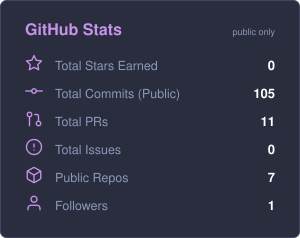
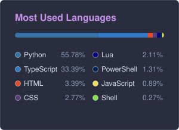

  
金沢工業大学　情報理工学部　知能情報システム学科　2年生。 

  
  
  
  

---

### 🛠️ 技術スタック (Tech Stack)

#### Languages & Core
      

#### Web & Backend
   

#### AI / ML & Vision
        

#### Environment
 

---
### 📊 GitHub アクティビティ統計 (Stats)

  
  
  

 

  

---

### 🏆 受賞歴 (Awards)

- 🏆 **ULS Consulting賞** - [Hackit 2026](https://hackit-2026.vercel.app/)（2026年8月1日〜8月3日開催）にて、開発チームの一員として **[Stopressure（停気圧）](https://github.com/ya0872/Stopressure)** を制作し、企業賞を受賞しました。
  気圧の変化から「体力予算」を算定し、その日に頑張らなくていい理由を根拠付きで提示するアプリケーションです。 `React` `TypeScript` `FastAPI` `Gemini API`

---

### 🚀 主なプロジェクト (Featured Projects)

- 🏆 **[Stopressure（停気圧）](https://github.com/ya0872/Stopressure)**
  気圧・カレンダー・ToDoから体力予算と省エネレベルを算出するアプリケーション（Hackit 2026 ULS Consulting賞受賞） `React` `FastAPI`
- 🚗 **[DriveRL](https://github.com/RI0806123789/DriveRL)**
  OpenStreetMapで再現した実在の街（銀座・梅田・栄・金沢）を舞台に、車載カメラ相当の映像をCNNで認識した結果だけを頼りに走る複数の自動運転車を、マルチエージェント強化学習（自作PPO）でリアルタイムに学習させる3Dシミュレーター。自動運転タクシーを呼んで乗車できる「実用モード」やPWAにも対応（自動運転プラットフォーム研究の一環） `TypeScript` `React` `Three.js` `Python` `FastAPI` `PyTorch`
- 🌤️ **[Markov-Weather-Station](https://github.com/RI0806123789/Markov-Weather-Station)**
  二次マルコフ連鎖を使った天気予報アプリケーション `Python`
- 📚 **[Markov Chain Craft](https://github.com/RI0806123789/Markov-Chain-Craft)**
  日本語テキストを形態素解析し、マルコフ連鎖モデルを構築・可視化・評価できるwebアプリケーション `HTML`
- 🤖 **[Persona-Chat-in-Discord](https://github.com/RI0806123789/Persona-Chat-in-Discord)**
  Discord内で動作するAIチャットボット `Python`
- ⚙️ **[dotfiles](https://github.com/RI0806123789/dotfiles)**
  Neovim中心の開発環境設定 `Lua`
- 👤 **[Human-Detection-and-Action-Recognition-with-MediaPipe](https://github.com/RI0806123789/Human-Detection-and-Action-Recognition-with-MediaPipe)**
  MediaPipe姿勢推定とCNNによる行動分類の実験リポジトリ（自動運転プラットフォーム研究の一環） `Python`
- 🎵🖼️ **[Audio-Image-Toolkit](https://github.com/RI0806123789/Audio-Image-Toolkit)**
  ffmpeg・waifu2xを操作できるオールインワンの音声・動画・画像変換GUIツール `Python`
- 📊 **College-Hub** *(Private)*
  大学生活のすべてを管理！成績登録・管理に加え、AIチャット（Gemini API）等を行うPWA統合管理ツール `HTML`
- 📱 **College-Hub-Mobile** *(Private)*
  モバイル版College Hub `Kotlin`

---

  📫 <b>Contact:</b> liangzhenyiteng5@gmail.com | 📍 Kanazawa  
  お気軽にフォローや Star をどうぞ！🌟

